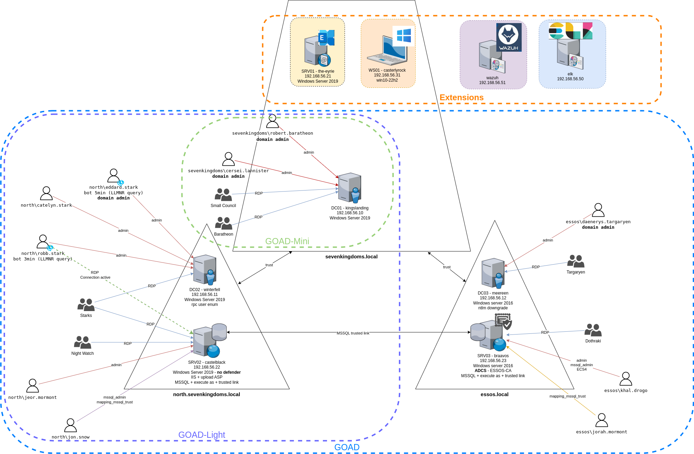

# GOAD Lab Setup
<p align="center">
     
</p>

<p align="center">
    
</p>

### GOAD v3 Documentaion is available [here](https://github.com/Orange-Cyberdefense/GOAD).

## <u>Intro:</u>

There are many writeups on the internet that show how to install GOAD. Why did I write another one? 

My goal was to minimize the RAM requirements and to have all the VMs run directly under <b>VMware Workstation Pro</b> on the <b>Windows (11) host</b>. This also enables easier copy/paste between environments which other install did not provide. Also shutting down any unused VMs (such as a provioning VM after provioning) in this environment reduces RAM usage.

My writeup is available [here](/pdf/GOAD-AD-Lab-Setup-from-Windows-Host.pdf).

I have also included a copy of all the files I modified [here](files/). The locations where these files go are documented in the Writeup.

## <u>TLDR;</u>

Some writeups on the internet for a GOAD install are very good and simple but require you to do the <b>Windows (10-11) OS host</b> install by using an <b>Ubuntu 20.04 (or Debian) VM</b> that has at least 40 GB (for GOAD-Light) where you must create the <b>Ubuntu VM</b> with the "Processors" -> "Virtualization engine" -> "Virtualalize Intel VT-x/EPT or AMD-V/RVI" option enabled in <b>WMware Workstation Pro</b>.

Next you will eventually end up installing <b>VirtualBox</b> on the <b>Ubuntu (or Debian) VM</b> and then run through the GOAD install and provioning. The result is you will have multiple GOAD Windows VMs under <b>VirtualBox</b> installed on the <b>Ubuntu VM</b> (with a large RAM footprint). This is referred to as <b>nested virtualization</b>. Although it may be simpler to install GOAD in this environment, the nested VMs come with some downsides:

- You need to create a large <b>Ubuntu 20.04 VM</b> under <b>VMware Workstation Pro</b> as mentioned above, where you install <b>VirtualBox</b> then you create all the <B>5 GOAD Windows VMs</b>. 

- Each GOAD VM you create under the <b>Ubuntu 20.04 VM</b> requires you have RAM space allocated:
```
- DC01 ->   3000 MB
- DC02 ->   3000 MB
- DC03 ->   3000 MB
- SRV02 ->  6000 MB
--SRV03 ->  5000 MB
-------------------
- Total -> 20000 MB or 20 GB just for the GOAD VMs
```

You most likely will want to install a <b>kali VM</b> under <b>VirtualBox</b> as it would be easier for it to access the 5 GOAD VMs.
```
-- Kali ->   20 GB more for minimal install, or toal of 40 GB
```

An <b>Ubuntu 20.04 Desktop</b> itself requires a minimun of 4 GB RAM.
```
-- Total now is 44 GB minimum 
```

You <b>should not use this mimimum</b>, you should add addtional RAM as the <b>Ubuntu VM</b> also has <b>VirtualBox</b> installed on it and it has its own requirements. I was able to get away with using (44-8 + margin) 40 GB of RAM for my test of this configuration of <b>Ubuntu VM GOAD-Light</b> install.

All this ignores the VM processor requirements. I was able to get away with using 8 processors for my test of this configuration of <b>Ubuntu VM GOAD-Light</b> install figuring each VM needs 2 CPUs (6+host+kali) to run effectively.

OK, enough about this approach.

### Now refer to my writeup [here](pdf/GOAD-AD-Lab-Setup-from-Windows-Host.pdf).

- <b>All GOAD VMs</b> are directly created in <b>VMware Workstation Pro</b> using <b>vagrant</b> directly on the <b>Windows (11) OS host</b>.

-  A minimal <b>Ubuntu 20.04 Desktop VM</b> was directly created in <b>VMware Workstation Pro</b> on the <b>Windows (11) OS host</b> which used <b>ansible</b> to create the Active Directoy environment. Once created, you can suspend this VM thereby minimizing the RAM footprint.

-  You create the <b>kali VM</b> directly in <b>VMware Workstation Pro</b> which enables copy/paste and directly allows network access to the GOAD Windows VMs.

-  My configuration ended up requiring less that <b>32 GB RAM</b> for a <b>full GOAD install</b> including the base Windows OS requirement of about 7 GB. See [my writeup](pdf/GOAD-AD-Lab-Setup-from-Windows-Host.pdf).

-  Because the GOAD VMs are not running in a nested environment, they are more responsive.

## My writeup was inspired by reviewing Huriye Özdemir's writeup - [GOAD Active Directory Lab Setup from a Windows host](https://l4dybug.medium.com/goad-active-directory-lab-setup-from-a-windows-host-dcdbfbb1ef08)
